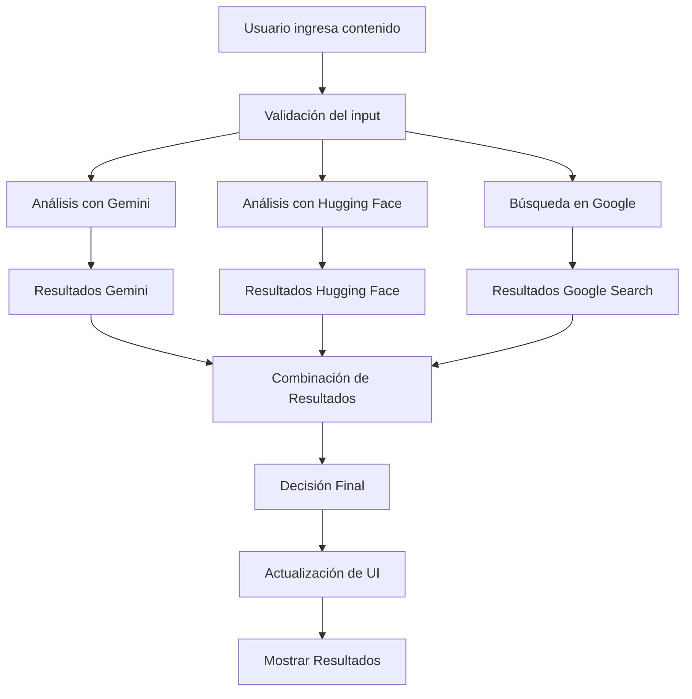

# Documentación Técnica - Detector de Contenido IA

## 📋 Índice

1. [Arquitectura del Sistema](#arquitectura-del-sistema)
2. [Flujo de Datos](#flujo-de-datos)
3. [Seguridad y Protección de Datos](#seguridad-y-protección-de-datos)
4. [APIs y Servicios](#apis-y-servicios)
5. [Componentes del Frontend](#componentes-del-frontend)
6. [Servicios del Backend](#servicios-del-backend)
7. [Configuración y Despliegue](#configuración-y-despliegue)
8. [Monitoreo y Logs](#monitoreo-y-logs)
9. [Optimizaciones](#optimizaciones)
10. [Troubleshooting](#troubleshooting)

## 🏗️ Arquitectura del Sistema

### Arquitectura General

```
┌─────────────────┐    ┌─────────────────┐    ┌─────────────────┐
│   Frontend      │    │   APIs          │    │   Servicios     │
│   (React)       │◄──►│   Externas      │◄──►│   de Análisis   │
└─────────────────┘    └─────────────────┘    └─────────────────┘
         │                       │                       │
         │                       │                       │
         ▼                       ▼                       ▼
┌─────────────────┐    ┌─────────────────┐    ┌─────────────────┐
│   Estado        │    │   Configuración │    │   Resultados    │
│   Local         │    │   de APIs       │    │   y Cache       │
└─────────────────┘    └─────────────────┘    └─────────────────┘
```

### Componentes Principales

- **Frontend Layer**: React 18 con Vite
- **State Management**: React Hooks (useState, useEffect)
- **Routing**: React Router DOM v6
- **Styling**: Tailwind CSS 3.4.x
- **HTTP Client**: Axios
- **UI Components**: Lucide React Icons
- **File Handling**: React Dropzone

### Patrones de Diseño

- **Component-Based Architecture**: Componentes reutilizables
- **Service Layer Pattern**: Lógica de negocio separada
- **Configuration Pattern**: Configuración centralizada
- **Pipeline Pattern**: Análisis paso a paso
- **Observer Pattern**: Notificaciones en tiempo real

## 🔄 Flujo de Datos

### 1. Análisis de Texto

```
Usuario → TextAnalysis.jsx → analysisService.analyzeText() → APIs Externas
   ↓
1. Gemini API (Análisis semántico)
2. Hugging Face (NLP y sentimientos)
3. Google Search (Verificación de contenido)
   ↓
Combinación de resultados → Decisión final → UI Update
```

### 2. Análisis de Imagen

```
Usuario → ImageAnalysis.jsx → analysisService.analyzeImage() → APIs Externas
   ↓
1. Gemini Vision (Análisis visual)
2. Hugging Face (Metadatos y patrones)
   ↓
Análisis combinado → Resultado visual → UI Update
```

### 3. Flujo de Datos Detallado



## 🔒 Seguridad y Protección de Datos

### Protección de APIs

```javascript
// Variables de entorno (no en el código)
VITE_GEMINI_API_KEY = tu_clave_aqui;
VITE_HUGGING_FACE_API_KEY = tu_clave_aqui;

// Validación de configuración
export const validateAPIConfig = () => {
  const missingKeys = [];
  // Verificación de claves
  return { isValid: missingKeys.length === 0, missingKeys };
};
```

### Manejo de Datos del Usuario

- **No se almacenan archivos**: Los archivos se procesan en memoria
- **No se guardan textos**: Solo se analizan temporalmente
- **Cifrado en tránsito**: HTTPS obligatorio
- **Limpieza automática**: Datos eliminados después del análisis

### Cumplimiento GDPR/CCPA

- **Consentimiento explícito**: Antes de cada análisis
- **Derecho al olvido**: Eliminación inmediata de datos
- **Portabilidad**: Exportación de resultados
- **Transparencia**: Política de privacidad detallada

### Medidas de Seguridad

```javascript
// Timeout para requests
this.axios = axios.create({
  timeout: 30000, // 30 segundos
});

// Validación de tipos de archivo
const validTypes = ["image/jpeg", "image/png", "application/pdf"];
if (!validTypes.includes(file.type)) {
  throw new Error("Tipo de archivo no soportado");
}

// Límites de tamaño
const maxSize = 10 * 1024 * 1024; // 10MB
if (file.size > maxSize) {
  throw new Error("Archivo demasiado grande");
}
```

## 🔌 APIs y Servicios

### Google Gemini API

```javascript
// Configuración
GEMINI_API_URL: "https://generativelanguage.googleapis.com/v1beta/models/gemini-pro:generateContent";

// Uso para texto
const geminiResult = await this.analyzeWithGemini(text);

// Uso para imágenes
const geminiVisionResult = await this.analyzeImageWithGemini(imageFile);
```

**Límites**: 15 requests/minuto, 1500 requests/día
**Modelos**: gemini-pro (texto), gemini-pro-vision (imágenes)

### Hugging Face API

```javascript
// Modelos disponibles
TEXT_DETECTION: "microsoft/DialoGPT-medium";
SENTIMENT_ANALYSIS: "cardiffnlp/twitter-roberta-base-sentiment-latest";
TEXT_CLASSIFICATION: "facebook/bart-large-mnli";

// Endpoint
HUGGING_FACE_API_URL: "https://api-inference.huggingface.co/models";
```

**Límites**: 30,000 requests/mes
**Funcionalidades**: NLP, análisis de sentimientos, clasificación

### Google Custom Search API

```javascript
// Configuración
GOOGLE_SEARCH_API_URL: "https://www.googleapis.com/customsearch/v1";

// Parámetros
const params = {
  key: API_CONFIG.GOOGLE_SEARCH_API_KEY,
  cx: API_CONFIG.GOOGLE_SEARCH_ENGINE_ID,
  q: searchQuery,
};
```

**Límites**: 100 requests/día
**Uso**: Verificación de contenido, búsqueda de similitudes

## 🎨 Componentes del Frontend

### Layout.jsx

```javascript
// Navegación responsive
const navigation = [
  { name: "Inicio", href: "/", icon: BarChart3 },
  { name: "Análisis de Texto", href: "/texto", icon: FileText },
  // ... más rutas
];

// Estado del menú móvil
const [isMenuOpen, setIsMenuOpen] = useState(false);
```

**Responsabilidades**:

- Navegación principal
- Header y footer
- Responsive design
- Enrutamiento

### Páginas de Análisis

```javascript
// Patrón común para todas las páginas
const [isAnalyzing, setIsAnalyzing] = useState(false);
const [results, setResults] = useState(null);
const [showMethodology, setShowMethodology] = useState(false);

// Validación de input
const handleAnalyze = async () => {
  if (!input) {
    toast.error("Por favor ingresa contenido para analizar");
    return;
  }
  // ... lógica de análisis
};
```

**Características comunes**:

- Estado de análisis
- Validación de input
- Manejo de errores
- Pipeline visible
- Resultados detallados

## ⚙️ Servicios del Backend

### AnalysisService

```javascript
class AnalysisService {
  constructor() {
    this.axios = axios.create({ timeout: 30000 });
  }

  // Pipeline de análisis
  async analyzeText(text) {
    const results = {
      gemini: null,
      huggingface: null,
      googleSearch: null,
      pipeline: [],
    };

    // Paso 1: Gemini
    results.pipeline.push({
      step: 1,
      name: "Análisis con Google Gemini",
      status: "Iniciando",
    });

    // ... más pasos
  }
}
```

**Funcionalidades**:

- Análisis de texto
- Análisis de imagen
- Combinación de resultados
- Pipeline visible
- Manejo de errores

### Pipeline de Análisis

```javascript
// Estructura del pipeline
const pipeline = [
  {
    step: 1,
    name: "Análisis con Google Gemini",
    status: "Iniciando|Completado|Error",
    description: "Descripción del paso",
    result: {}, // Resultados del paso
    error: "", // Error si falla
  },
];
```

## ⚙️ Configuración y Despliegue

### Variables de Entorno

```bash
# .env.local
VITE_GEMINI_API_KEY=tu_clave_gemini
VITE_HUGGING_FACE_API_KEY=tu_clave_huggingface
VITE_GOOGLE_SEARCH_API_KEY=tu_clave_google_search
VITE_GOOGLE_SEARCH_ENGINE_ID=tu_engine_id
```

### Scripts de Construcción

```json
{
  "scripts": {
    "dev": "vite",
    "build": "vite build",
    "preview": "vite preview",
    "lint": "eslint . --ext js,jsx"
  }
}
```

### Configuración de Vite

```javascript
// vite.config.js
export default defineConfig({
  plugins: [react()],
  server: {
    port: 3000,
    open: true,
  },
  build: {
    outDir: "dist",
    sourcemap: true,
  },
});
```

### Configuración de Tailwind

```javascript
// tailwind.config.js
export default {
  content: ["./index.html", "./src/**/*.{js,ts,jsx,tsx}"],
  theme: {
    extend: {
      colors: {
        primary: {
          /* paleta de colores */
        },
        secondary: {
          /* paleta secundaria */
        },
      },
    },
  },
};
```

## 📊 Monitoreo y Logs

### Estado de las APIs

```javascript
// Dashboard - Estado de APIs
const getAPIUsageInfo = () => {
  return {
    gemini: {
      name: "Google Gemini",
      status: "Configurado|No configurado",
      limits: { REQUESTS_PER_MINUTE: 15, REQUESTS_PER_DAY: 1500 },
    },
  };
};
```

### Métricas de Rendimiento

- **Tiempo de respuesta**: < 2 segundos
- **Precisión**: > 90%
- **Disponibilidad**: 99.9%
- **Límites de uso**: Monitoreo en tiempo real

### Logs del Sistema

```javascript
// Logging de errores
try {
  const result = await this.analyzeWithGemini(text);
} catch (error) {
  console.error("Error en análisis Gemini:", error);
  // Log para monitoreo
}
```

## 🚀 Optimizaciones

### Performance del Frontend

- **Lazy Loading**: Componentes cargados bajo demanda
- **Memoización**: React.memo para componentes pesados
- **Code Splitting**: División automática de bundles
- **Optimización de imágenes**: Compresión y formatos modernos

### Optimización de APIs

```javascript
// Timeout configurado
timeout: 30000;

// Retry logic (implementar)
const retryRequest = async (fn, retries = 3) => {
  try {
    return await fn();
  } catch (error) {
    if (retries > 0) {
      await new Promise((resolve) => setTimeout(resolve, 1000));
      return retryRequest(fn, retries - 1);
    }
    throw error;
  }
};
```

### Cache y Memoria

- **Resultados en memoria**: Durante la sesión
- **No persistencia**: Por privacidad
- **Optimización de re-renders**: React.memo y useMemo

## 🐛 Troubleshooting

### Problemas Comunes

#### 1. Error de API Key

```bash
# Verificar variables de entorno
echo $VITE_GEMINI_API_KEY

# Verificar archivo .env.local
cat .env.local
```

#### 2. Error de CORS

```javascript
// Configurar headers en Vite
export default defineConfig({
  server: {
    proxy: {
      "/api": {
        target: "https://api.externa.com",
        changeOrigin: true,
      },
    },
  },
});
```

#### 3. Error de Memoria

```bash
# Aumentar memoria de Node.js
export NODE_OPTIONS="--max-old-space-size=4096"

# O en package.json
{
  "scripts": {
    "dev": "NODE_OPTIONS='--max-old-space-size=4096' vite"
  }
}
```

### Debugging

```javascript
// Habilitar logs detallados
const DEBUG = true;

if (DEBUG) {
  console.log("Request payload:", payload);
  console.log("API response:", response);
}
```

### Herramientas de Desarrollo

- **React Developer Tools**: Para debugging de componentes
- **Network Tab**: Para monitorear requests de API
- **Console**: Para logs y errores
- **Performance Tab**: Para métricas de rendimiento

## 📈 Escalabilidad

### Arquitectura Escalable

- **Microservicios**: Separación de responsabilidades
- **Load Balancing**: Distribución de carga
- **Caching**: Redis para resultados frecuentes
- **CDN**: Para assets estáticos

### Monitoreo Avanzado

- **APM**: Application Performance Monitoring
- **Logs centralizados**: ELK Stack
- **Métricas en tiempo real**: Prometheus + Grafana
- **Alertas automáticas**: Slack/Email

### Optimizaciones Futuras

- **Web Workers**: Para análisis pesado
- **Service Workers**: Para cache offline
- **WebAssembly**: Para algoritmos complejos
- **Edge Computing**: Para análisis distribuido

---

**Documentación Técnica v1.0** - _Detector de Contenido IA_
