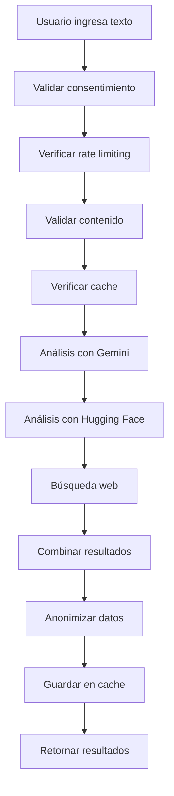

# Documentación Técnica - Sistema de Detección de IA

## 📋 Índice

1. [Arquitectura del Sistema](#arquitectura-del-sistema)
2. [Configuración de APIs](#configuración-de-apis)
3. [Servicios y Componentes](#servicios-y-componentes)
4. [Flujo de Datos](#flujo-de-datos)
5. [Seguridad y Privacidad](#seguridad-y-privacidad)
6. [Despliegue y Producción](#despliegue-y-producción)
7. [Monitoreo y Logs](#monitoreo-y-logs)
8. [Troubleshooting](#troubleshooting)

## 🏗️ Arquitectura del Sistema

### Diagrama de Arquitectura

```
┌─────────────────┐    ┌─────────────────┐    ┌─────────────────┐
│   Frontend      │    │   Services      │    │   External APIs │
│   (React)       │    │   Layer         │    │                 │
├─────────────────┤    ├─────────────────┤    ├─────────────────┤
│ • TextAnalysis  │◄──►│ • MainAnalysis  │◄──►│ • Gemini API    │
│ • ImageAnalysis │    │ • TextAnalysis  │    │ • Hugging Face  │
│ • VideoAnalysis │    │ • WebSearch     │    │ • Google Search │
│ • DocumentAnalysis│   │ • Security      │    │ • Firebase      │
└─────────────────┘    └─────────────────┘    └─────────────────┘
```

### Componentes Principales

#### Frontend (React)
- **App.jsx**: Componente raíz con navegación
- **TextAnalysis.jsx**: Interfaz de análisis de texto
- **Componentes futuros**: ImageAnalysis, VideoAnalysis, DocumentAnalysis

#### Services Layer
- **mainAnalysisService.js**: Coordinador principal
- **textAnalysisService.js**: Análisis específico de texto
- **webSearchService.js**: Búsqueda y verificación web
- **securityService.js**: Seguridad y privacidad

#### Configuration
- **api.js**: Configuración centralizada de APIs
- **firebase.js**: Configuración de base de datos

## 🔧 Configuración de APIs

### Google Gemini API

```javascript
// Configuración en src/config/api.js
GEMINI: {
  API_KEY: import.meta.env.VITE_GEMINI_API_KEY,
  BASE_URL: "https://generativelanguage.googleapis.com/v1beta",
  MODELS: {
    TEXT: "gemini-2.0-flash-exp",
    VISION: "gemini-2.0-flash-exp"
  },
  TIMEOUT: 30000,
  MAX_TOKENS: 8192,
  TEMPERATURE: 0.1
}
```

**Uso:**
```javascript
const response = await axios.post(url, {
  contents: [{ parts: [{ text: prompt }] }],
  generationConfig: {
    temperature: API_CONFIG.GEMINI.TEMPERATURE,
    maxOutputTokens: API_CONFIG.GEMINI.MAX_TOKENS
  }
});
```

### Hugging Face API

```javascript
// Configuración
HUGGING_FACE: {
  API_KEY: import.meta.env.VITE_HUGGING_FACE_API_KEY,
  BASE_URL: "https://api-inference.huggingface.co",
  MODELS: {
    SENTIMENT: "cardiffnlp/twitter-roberta-base-sentiment",
    TEXT_CLASSIFICATION: "facebook/bart-large-mnli"
  },
  TIMEOUT: 25000,
  MAX_RETRIES: 3
}
```

**Uso:**
```javascript
const response = await axios.post(
  `${API_CONFIG.HUGGING_FACE.BASE_URL}/${model}`,
  { inputs: text },
  { headers: { Authorization: `Bearer ${API_KEY}` } }
);
```

### Google Custom Search API

```javascript
// Configuración
GOOGLE_SEARCH: {
  API_KEY: import.meta.env.VITE_GOOGLE_SEARCH_API_KEY,
  ENGINE_ID: import.meta.env.VITE_GOOGLE_SEARCH_ENGINE_ID,
  BASE_URL: "https://www.googleapis.com/customsearch/v1",
  TIMEOUT: 20000,
  MAX_RESULTS: 10
}
```

**Uso:**
```javascript
const url = `${BASE_URL}?key=${API_KEY}&cx=${ENGINE_ID}&q=${query}`;
const response = await axios.get(url);
```

## 🧩 Servicios y Componentes

### MainAnalysisService

**Responsabilidades:**
- Coordinación de análisis multi-modal
- Gestión de cache y rate limiting
- Anonimización de resultados
- Logging de eventos de seguridad

**Métodos principales:**
```javascript
async analyzeContent(content, type = 'auto')
async analyzeText(text)
async analyzeImage(imageFile)
async analyzeVideo(videoFile)
async analyzeDocument(documentFile)
combineResults(results)
```

### TextAnalysisService

**Responsabilidades:**
- Análisis específico de contenido textual
- Integración con Gemini y Hugging Face
- Detección de patrones lingüísticos
- Análisis de complejidad y legibilidad

**Métodos principales:**
```javascript
async analyzeWithGemini(text)
async analyzeWithHuggingFace(text)
analyzeWithLocalPatterns(text)
detectLanguagePatterns(text)
detectAIPatterns(text)
detectHumanPatterns(text)
calculateTextComplexity(text)
calculateReadability(text)
```

### WebSearchService

**Responsabilidades:**
- Búsqueda de contenido similar en la web
- Verificación de fuentes confiables
- Cálculo de relevancia y similitud
- Análisis de resultados de búsqueda

**Métodos principales:**
```javascript
async searchWebContent(text)
extractKeywords(text)
createSearchQueries(keywords, text)
isValidSearchResult(item, originalText)
calculateRelevance(text, searchResult)
analyzeSearchResults(searchResults, originalText)
```

### SecurityService

**Responsabilidades:**
- Gestión de consentimiento del usuario
- Rate limiting y control de acceso
- Anonimización de datos
- Cumplimiento GDPR
- Limpieza automática de datos

**Métodos principales:**
```javascript
async requestUserConsent()
checkRateLimit()
anonymizeData(data)
deleteUserData()
exportUserData()
getSecurityStatus()
```

## 🔄 Flujo de Datos

### 1. Análisis de Texto



### 2. Proceso de Anonimización

```javascript
// Ejemplo de anonimización
const anonymizedData = {
  ...originalData,
  // Remover información personal
  userId: undefined,
  ipAddress: undefined,
  userAgent: undefined,
  
  // Anonimizar timestamps
  timestamp: date.toISOString().split('T')[0], // Solo fecha
  
  // Mantener solo datos necesarios para análisis
  content: content.substring(0, 1000),
  result: result,
  confidence: confidence
};
```

### 3. Rate Limiting

```javascript
// Configuración de rate limits
const rateLimits = {
  minute: { limit: 10, window: 60000 },
  hour: { limit: 100, window: 3600000 },
  day: { limit: 1000, window: 86400000 }
};

// Verificación
checkRateLimit() {
  const now = Date.now();
  for (const [period, config] of this.rateLimits) {
    config.requests = config.requests.filter(
      timestamp => now - timestamp < config.window
    );
    if (config.requests.length >= config.limit) {
      return false; // Rate limit excedido
    }
    config.requests.push(now);
  }
  return true;
}
```

## 🔒 Seguridad y Privacidad

### Implementación de GDPR

#### 1. Consentimiento Explícito
```javascript
async requestUserConsent() {
  const consentData = {
    dataCollection: false,
    dataStorage: false,
    dataRetention: 30,
    anonymization: true,
    gdprCompliance: true
  };
  
  // Mostrar modal de consentimiento
  return new Promise((resolve) => {
    const modal = this.createConsentModal(consentData, resolve);
    document.body.appendChild(modal);
  });
}
```

#### 2. Derecho al Olvido
```javascript
async deleteUserData() {
  const keysToRemove = [];
  for (let i = 0; i < localStorage.length; i++) {
    const key = localStorage.key(i);
    if (key && key.startsWith('user_')) {
      keysToRemove.push(key);
    }
  }
  
  keysToRemove.forEach(key => localStorage.removeItem(key));
  
  return {
    success: true,
    itemsRemoved: keysToRemove.length
  };
}
```

#### 3. Portabilidad de Datos
```javascript
async exportUserData() {
  const userData = {};
  for (let i = 0; i < localStorage.length; i++) {
    const key = localStorage.key(i);
    if (key && key.startsWith('analysis_')) {
      userData[key] = JSON.parse(localStorage.getItem(key));
    }
  }
  return userData;
}
```

### Encriptación y Protección

#### 1. Headers de Seguridad
```javascript
const getAuthHeaders = (apiType) => {
  const headers = {
    'Content-Type': 'application/json',
    'Accept': 'application/json',
    'X-Requested-With': 'XMLHttpRequest'
  };
  
  switch (apiType) {
    case 'gemini':
      headers['x-goog-api-key'] = API_CONFIG.GEMINI.API_KEY;
      break;
    case 'huggingface':
      headers['Authorization'] = `Bearer ${API_CONFIG.HUGGING_FACE.API_KEY}`;
      break;
  }
  
  return headers;
};
```

#### 2. Validación de Entrada
```javascript
validateContent(content, type) {
  const config = ANALYSIS_CONFIG[type.toUpperCase()];
  
  if (type === 'text') {
    if (content.length < config.MIN_LENGTH) {
      throw new Error(`Mínimo ${config.MIN_LENGTH} caracteres`);
    }
    if (content.length > config.MAX_LENGTH) {
      throw new Error(`Máximo ${config.MAX_LENGTH} caracteres`);
    }
  }
  
  // Validar caracteres peligrosos
  if (content.includes('<script>') || content.includes('javascript:')) {
    throw new Error('Contenido no permitido detectado');
  }
}
```

## 🚀 Despliegue y Producción

### Configuración de Vercel

#### 1. vercel.json
```json
{
  "version": 2,
  "builds": [
    {
      "src": "package.json",
      "use": "@vercel/static-build",
      "config": {
        "distDir": "dist"
      }
    }
  ],
  "routes": [
    {
      "src": "/(.*)",
      "dest": "/index.html"
    }
  ],
  "env": {
    "NODE_ENV": "production"
  }
}
```

#### 2. Variables de Entorno en Vercel
```bash
# Configurar en Vercel Dashboard
VITE_GEMINI_API_KEY=your_gemini_key
VITE_HUGGING_FACE_API_KEY=your_huggingface_token
VITE_GOOGLE_SEARCH_API_KEY=your_google_search_key
VITE_GOOGLE_SEARCH_ENGINE_ID=your_engine_id
VITE_FIREBASE_API_KEY=your_firebase_key
VITE_FIREBASE_AUTH_DOMAIN=your_project.firebaseapp.com
VITE_FIREBASE_PROJECT_ID=your_project_id
VITE_FIREBASE_STORAGE_BUCKET=your_project.appspot.com
VITE_FIREBASE_MESSAGING_SENDER_ID=your_sender_id
VITE_FIREBASE_APP_ID=your_app_id
```

### Optimización de Producción

#### 1. Code Splitting
```javascript
// En vite.config.js
export default defineConfig({
  build: {
    rollupOptions: {
      output: {
        manualChunks: {
          vendor: ['react', 'react-dom'],
          ui: ['lucide-react'],
          services: ['./src/services']
        }
      }
    }
  }
});
```

#### 2. Caching Strategy
```javascript
// Cache de análisis
const CACHE_EXPIRY = 5 * 60 * 1000; // 5 minutos

saveToCache(key, data) {
  this.analysisCache.set(key, {
    ...data,
    timestamp: Date.now()
  });
}

isCacheValid(key) {
  const cached = this.analysisCache.get(key);
  if (!cached) return false;
  return Date.now() - cached.timestamp < CACHE_EXPIRY;
}
```

## 📊 Monitoreo y Logs

### Sistema de Logging

#### 1. Eventos de Seguridad
```javascript
logSecurityEvent(eventType, data) {
  const event = {
    type: eventType,
    timestamp: new Date().toISOString(),
    data: this.anonymizeData(data)
  };
  
  if (import.meta.env.MODE === 'development') {
    console.log('Security Event:', event);
  }
  
  if (import.meta.env.MODE === 'production') {
    this.sendSecurityLog(event);
  }
}
```

#### 2. Métricas de Rendimiento
```javascript
// Medición de tiempo de análisis
const startTime = Date.now();
const results = await analyzeContent(content);
const processingTime = Date.now() - startTime;

// Log de métricas
securityService.logSecurityEvent('analysis_completed', {
  type: 'text',
  processingTime,
  result: results.finalResult,
  confidence: results.confidence
});
```

### Monitoreo de APIs

#### 1. Health Checks
```javascript
async checkAPIHealth() {
  const health = {
    gemini: false,
    huggingface: false,
    googleSearch: false,
    firebase: false
  };
  
  try {
    // Test Gemini
    await testGeminiAPI();
    health.gemini = true;
  } catch (error) {
    console.warn('Gemini API no disponible:', error.message);
  }
  
  // Similar para otras APIs...
  return health;
}
```

#### 2. Rate Limit Monitoring
```javascript
getRateLimitStatus() {
  return {
    minute: {
      current: this.rateLimits.minute.requests.length,
      limit: this.rateLimits.minute.limit,
      remaining: this.rateLimits.minute.limit - this.rateLimits.minute.requests.length
    },
    hour: { /* similar */ },
    day: { /* similar */ }
  };
}
```

## 🔧 Troubleshooting

### Problemas Comunes

#### 1. Error de API Key
```
Error: API key de Gemini no configurada
```
**Solución:**
- Verificar que `.env.local` existe
- Confirmar que `VITE_GEMINI_API_KEY` está configurada
- Reiniciar el servidor de desarrollo

#### 2. Rate Limit Excedido
```
Error: Límite de solicitudes excedido
```
**Solución:**
- Esperar 1 minuto para límite por minuto
- Verificar límites en `SECURITY_CONFIG.RATE_LIMIT`
- Implementar backoff exponencial

#### 3. Error de CORS
```
Error: CORS policy blocks request
```
**Solución:**
- Verificar configuración de Vite
- Confirmar que las APIs permiten el dominio
- Usar proxy en desarrollo si es necesario

#### 4. Error de Firebase
```
Error: Firebase configuration missing
```
**Solución:**
- Verificar todas las variables de Firebase en `.env.local`
- Confirmar que el proyecto Firebase existe
- Verificar permisos de Firestore

### Debugging

#### 1. Modo Debug
```javascript
// En desarrollo, habilitar logs detallados
if (import.meta.env.MODE === 'development') {
  console.log('API Config:', API_CONFIG);
  console.log('Security Status:', securityService.getSecurityStatus());
}
```

#### 2. Network Inspector
```javascript
// Interceptor de Axios para debugging
axios.interceptors.request.use(request => {
  console.log('Request:', request);
  return request;
});

axios.interceptors.response.use(
  response => {
    console.log('Response:', response);
    return response;
  },
  error => {
    console.error('Error:', error);
    return Promise.reject(error);
  }
);
```

### Performance Optimization

#### 1. Lazy Loading
```javascript
// Cargar componentes solo cuando se necesiten
const ImageAnalysis = lazy(() => import('./components/ImageAnalysis.jsx'));
const VideoAnalysis = lazy(() => import('./components/VideoAnalysis.jsx'));
```

#### 2. Memoization
```javascript
// Memoizar resultados costosos
const memoizedAnalysis = useMemo(() => {
  return analyzeContent(content);
}, [content]);
```

#### 3. Debouncing
```javascript
// Debounce para búsquedas
const debouncedSearch = useCallback(
  debounce((query) => {
    performSearch(query);
  }, 300),
  []
);
```

---

Esta documentación técnica proporciona una guía completa para entender, mantener y extender el sistema de detección de IA. Para más información específica, consulta los archivos de código fuente y la documentación de las APIs utilizadas.